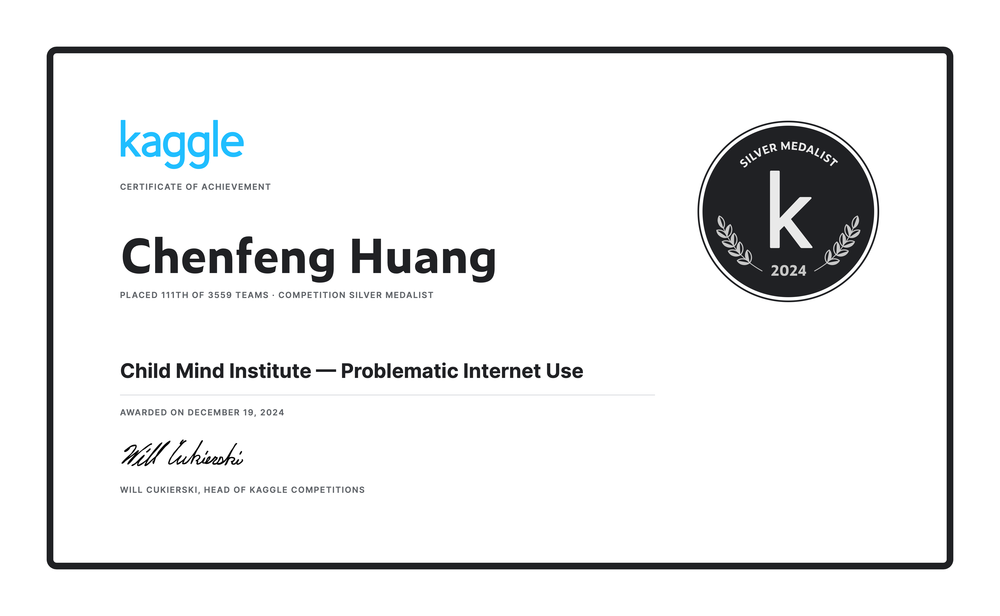

## Child Mind Institute — Problematic Internet Use (CMI‑PIU) Solution


This solution was developed for the Kaggle competition [Child Mind Institute — Problematic Internet Use](https://www.kaggle.com/competitions/child-mind-institute-problematic-internet-use), where participants predict the severity category `sii ∈ {0,1,2,3}` using demographics, clinical/questionnaire data, and wearable time‑series signals. The approach combines tabular features with per‑participant time‑series summary statistics and trains tree‑based regressors with out‑of‑fold validation and threshold optimization for the Quadratic Weighted Kappa (QWK) metric.

Our work earned a Silver Medal. The repository contains an end‑to‑end notebook that reproduces training and inference and generates a valid `submission.csv`. 🥈

For a detailed walkthrough of the solution and insights into the modeling process, see my [blog post](https://chenfenghuang.info/2024/12/20/Kaggle-CMI-PIU/).


## Competition Overview

### Competition Introduction

The task is to build a predictive model for `sii` (four ordered categories) using a mixture of tabular data (demographics, physical health, and questionnaires such as SDS/PCIAT) and multivariate time‑series recorded per participant. The evaluation metric is **Quadratic Weighted Kappa (QWK)**, which measures agreement between predicted classes and ground truth while penalizing larger class discrepancies more heavily.

### Competition Background

Problematic Internet Use is an emerging mental‑health concern. The dataset couples questionnaire and clinical information with wearable time‑series, enabling models that can leverage both static and dynamic signals. A practical solution must align columns across train/test, summarize long time‑series efficiently, and handle missing/categorical features robustly while optimizing directly for the ordered‑class QWK objective.

## Solution Overview

This solution comprises three components:

1. **Time‑Series Feature Extraction**: Aggregate each participant’s parquet time‑series into compact summary statistics via `DataFrame.describe()` (e.g., count, mean, std, quantiles, max) per channel.
2. **Tabular Fusion and Preprocessing**: Merge time‑series stats with tabular features by `id`, fill and encode season‑type categoricals, and align train/test columns.
3. **Modeling and Thresholding**: Train tree‑based regressors with 5‑fold stratified CV on `sii`, ensemble predictions where helpful, and optimize three thresholds to discretize continuous predictions into {0,1,2,3} maximizing QWK.

The final output is a two‑column `submission.csv` with `id,sii`.

## Detailed Solution

### 1. Data Preprocessing

#### Data Reading and Transformation

- Read tabular files: `dataset/train.csv`, `dataset/test.csv`, and `dataset/sample_submission.csv`.
- Load per‑participant time‑series from `dataset/series_train.parquet/` and `dataset/series_test.parquet/`, where each participant has `id=<participant_id>/part-0.parquet`.
- Drop the `step` column from time‑series and compute `describe()` for each channel; flatten into features `stat_0 .. stat_N`.
- Merge the resulting stats DataFrame to the tabular frames on `id`, then drop `id` after merging.

#### Categorical Handling and Missing Values

- Identify season‑type categorical columns (e.g., `Basic_Demos-Enroll_Season`, `CGAS-Season`, `Physical-Season`, `PAQ_*`, `SDS-Season`, `PreInt_EduHx-Season`).
- Fill missing categorical values with `"Missing"` and encode them into integers consistently across train/test.
- Keep numeric columns as is; imputation strategies can be applied if needed (the notebook includes utilities/libs for imputation and pipelines).

### 2. Modeling

#### Model Selection

- Use strong tree‑based regressors in regression mode:
  - `LightGBM` (`LGBMRegressor`)
  - `XGBoost` (`XGBRegressor`)
  - `CatBoost` (`CatBoostRegressor`)
- Optionally combine them via a simple ensemble such as `VotingRegressor`.

#### Cross‑Validation and OOF Predictions

- `StratifiedKFold(n_splits=5, shuffle=True, random_state=42)` on target `sii` to maintain class balance.
- Train on folds and collect out‑of‑fold (OOF) predictions for validation analysis.

#### Threshold Optimization and Metric

- Optimize three thresholds on OOF predictions to map continuous outputs to {0,1,2,3} maximizing **QWK**:
  - Define a `threshold_Rounder` that applies thresholding.
  - Use `scipy.optimize.minimize` to search thresholds that maximize QWK (equivalently minimize negative QWK).
- Apply the optimized thresholds to test predictions to produce discrete `sii`.

### 3. Inference and Submission

- Fit models on each fold, average test predictions across folds.
- Apply optimized thresholds to the averaged predictions.
- Save the final `submission.csv` with columns `id,sii` in the repo root.

## How to Reproduce

### Environment Setup

- Python 3.10+ recommended
- Install dependencies:

```bash
pip install -r requirements.txt
```

Key libraries: `numpy`, `pandas`, `scikit-learn`, `lightgbm`, `xgboost`, `catboost`, `scipy`, `pyarrow`, `tqdm`.

### Data Layout

Place the competition data under `dataset/`:

```
dataset/
├─ train.csv
├─ test.csv
├─ sample_submission.csv
├─ series_train.parquet/
│  └─ id=<participant_id>/part-0.parquet
└─ series_test.parquet/
   └─ id=<participant_id>/part-0.parquet
```

### Data Source and Citation

- Dataset and rules: see `dataset/data_source.md` and the Kaggle data page: https://www.kaggle.com/competitions/child-mind-institute-problematic-internet-use/data

```bibtex
@misc{child-mind-institute-problematic-internet-use,
    author = {Adam Santorelli and Arianna Zuanazzi and Michael Leyden and Logan Lawler and Maggie Devkin and Yuki Kotani and Gregory Kiar},
    title = {Child Mind Institute — Problematic Internet Use},
    year = {2024},
    howpublished = {\url{https://kaggle.com/competitions/child-mind-institute-problematic-internet-use}},
    note = {Kaggle}
}
```

### Training and Inference

- Launch Jupyter and open the notebook:

- Run all cells in `cmi-piu-silver-medal-solution.ipynb` to train, validate, and generate `submission.csv` in the repository root.

## Author

Maintainer: Chenfeng Huang - [Kaggle](https://www.kaggle.com/alrickh)

For questions, please open an issue or discussion in this repository.

## License

Distributed under the terms of the license in `LICENSE`.
 
